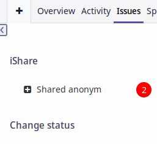

# Redmine iShare

Plugin for redmine.
Allows you to open access to a specific task in read mode for an anonymous user

Redmine.org plugin page: https://www.redmine.org/plugins/redmine_ishare
Github: https://github.com/JKeySZR/redmine_ishare

## Features

* No need to create any user accounts for anonymous user
* Creating different passwords for the same issue
* Specify access expiration time

 

## Screenshot

How does it look from the side of an anonymous user who does not have a password or is incorrect
and which has the correct password.

With an easter egg in the form of a change of Ava with each download. Refresh the page.


How it looks inside Redmine


## Getting the plugin

A copy of the plugin can be downloaded from [GitHub](https://github.com/JKeySZR/redmine_ishare)

## Installation

To install the plugin clone the repo from github and migrate the database:

```
$ cd $REDMINE_ROOT
$ git clone -b stable https://github.com/JKeySZR/redmine_ishare.git plugins/redmine_ishare
$ bundle config set --local without 'development test'
$ bundle install
$ bundle exec rake redmine:plugins:migrate NAME=redmine_ishare
```

To uninstall the plugin migrate the database back and remove the plugin:

```
$ cd $REDMINE_ROOT
$ bundle exec rake redmine:plugins:migrate NAME=redmine_ishare VERSION=0 RAILS_ENV=production
$ rm -rf plugins/redmine_ishare public/plugin_assets/redmine_ishare
```

Further information about plugin installation can be found at: https://www.redmine.org/wiki/redmine/Plugins

## Usage

What the plugin currently does:

Functionality out of the box

`/issues/:id` Example: /ishare/555

When accessing which, access rights to the task are checked, and whether authentication is required
basically.

По аналогии для `доступа` по `паролю` сделан путь вида

`/ishare/:id`   Example:  /ishare/555

By analogy, for `access` by `password`, a path of the form


### Creating Access

In order to create access by password, you need to::
- select the desired issue
- In sidebar press Shared anonym 
- 
- The form for creating access will open.


A table of existing accesses is displayed at the top. which contains the following information:

First column:

- Access creation time
- Who created the access (clickable link to the user)
- How long will this password be valid for?

Second column
- The password itself is 10 characters

Third column
- Comment. Brief note. For example, for what/whom the access was granted

For convenience, when opening the form, a random password is automatically generated so as not to suffer
the throes of a "creative password".
But if you wish, you can specify your own, in a simpler way, for example 123445 =)

## Compatibility

The latest version of this plugin tested on Redmine 4.2.x.

Tests in different environments were not conducted.
The plugin was written for such an environment:

Environment:
Redmine version                4.2.8.stable
Ruby version                   2.7.6-p219 (2022-04-12) [x86_64-linux]
Rails version                  5.2.8.1
Database adapter               Mysql2

Should work, but not the fact =)

| `Redmine` version  | >= 4.2.0 |
| `Ruby`_ version  | >= 2.7  |
| Database version  | MySQL >= 5.7 or PostgreSQL >= 9.6  |


## License

This plugin is licensed under the GPL license. See LICENSE-file for details.

## Copyright

Copyright (c) 2022 Bocharov-MS 