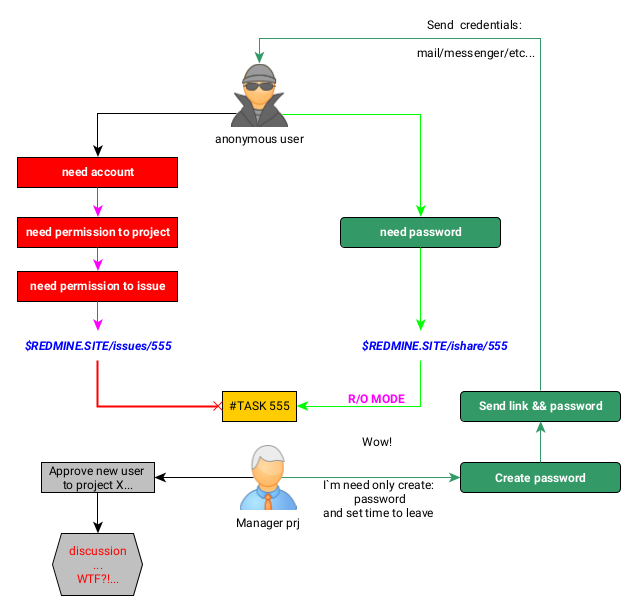
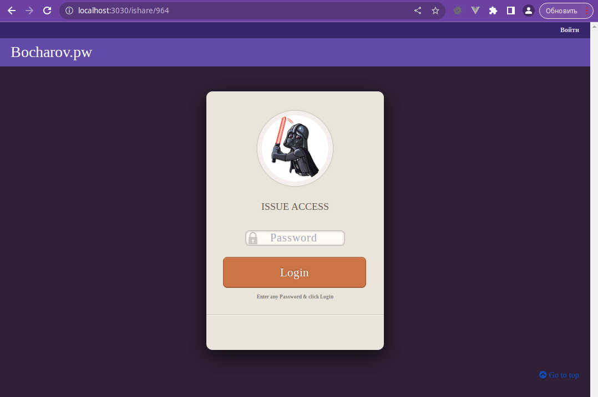
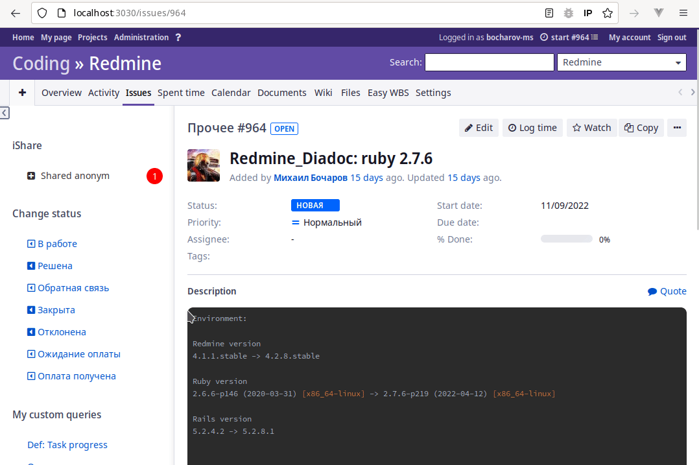
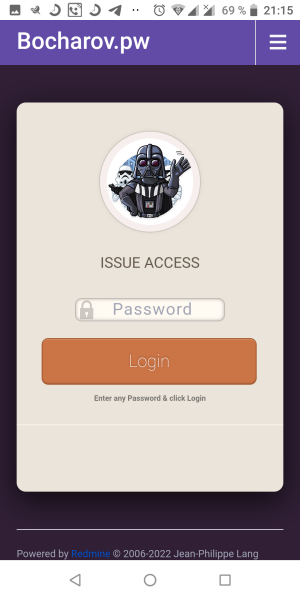
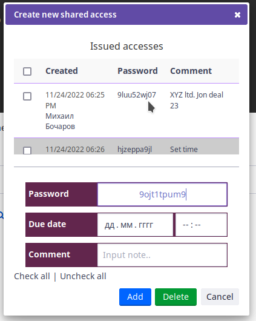

# Redmine  iShare    

Этот плагин писался под собственные нужды. Глядишь кому еще пригодится.

Иногда возникают такие ситуации когда есть задача, и есть необходимость или хочется предоставить доступ к issue 
стороннему наблюдателю. Чтобы он увидел своими глазами процесс по задаче. 
Но заводить отдельную учетку в системе смысла нет, как и желания.

- из-за одной задачи 
- далеко не все являются подготовленными пользователями  Redmie
- и объяснять, что и как, зачем 
куда там "в этом вашем редмайне тыкать" нет смысла
времени уйдет больше. 

Вот на такой случай и пригодится данный плагин к редмайн.




Redmine.org plugin page: https://www.redmine.org/plugins/redmine_ishare
Github: https://github.com/JKeySZR/redmine_ishare


## Screenshot
Как это выглядит со стороны анонимного пользователя , у которого нету пароля или неправильный
и у которого есть правильный пароль.

С пасхалкой в виде смены авы при каждой загрузкой.обновлении страницы.


Как это выглядит внутри Redmine  



## Требования

Тесты в разных средах не проводились.
Плагин писался для такого окружения: 

```
Environment:
Redmine version                4.2.8.stable
Ruby version                   2.7.6-p219 (2022-04-12) [x86_64-linux]
Rails version                  5.2.8.1
Database adapter               Mysql2
```
 
##  Установка 

 Ставится как обычный плагин редмайна, стандартные заклинаниня в темном царстве CLI:

```
$ cd $REDMINE_ROOT
$ git clone -b stable https://github.com/JKeySZR/redmine_ishare.git plugins/redmine_ishare
$ bundle config set --local without 'development test'
$ bundle install
$ bundle exec rake redmine:plugins:migrate NAME=redmine_ishare
```

Restart your application server (apache with passenger, nginx with passenger, unicorn, puma, etc.) and ``redmine_ishare`` is ready to use.


Для удалениня, колдуем в консоли такие матюки:

```
$ cd $REDMINE_ROOT
$ bundle exec rake redmine:plugins:migrate NAME=redmine_ishare VERSION=0 RAILS_ENV=production
$ rm -rf plugins/redmine_ishare public/plugin_assets/redmine_ishare
```

Дополнительную информацию об установке плагинов для Redmine можно найти по адресу: https://www.redmine.org/wiki/redmine/Plugins

## Как этим пользоваться

Чего он на даный момент умеет:

В Redmine для странинц задач есть есть отдельный путь  вида

`/issues/:id` Пример: /ishare/555

При заходе на которй проверяются права доступа к задаче, и требуется ли аутентификация
в принципе.

По аналогии для `доступа` по `паролю` сделан путь вида

`/ishare/:id`   Пример /ishare/555

При заходе на который отображается форма ввода пароля.




### Создание доступа

Для того чтобы создать дотступ по паролю надо:
- зайти в нужную задачу
- в боковой панели нажать на Shared anonym /
- 
- Откроется форма созаниня доступа



Сверху отображается таблица уже имеющихся доступов. В которой содержится следующая информация:

Первая колонка:

- Время создания доступа
- Кем был создан доступ ( кликабельная сылка на пользователя)
- Время до какого момента будет действовать данный пароль.

Вторая колонка
- Сам пароль 10 символов

Третья колонка
- Коментарий. Краткое примечание. Например для чего/кого выдан доступ

Для удобства, при открыти формы автоматически генерируется случайный пароль, чтобы не страдать
муками "креативного пароля".
Но при желании можно укзать свой, по проще, например 123445 =)


##  Совместимость с другими плагинами  

 Lightbox2


## Лицензия

This plugin is licensed under the GPL license. See LICENSE-file for details.

## Copyright

Copyright (c) 2022 Bocharov-MS 